# PTR Laboratoire 2

Spinelli Isaia

le 16 Octobre 2019

## Gettimeofday et Gettimeofday2

3. On comparant les résultats de gettimeofday et gettimeofday2, On peut voir que le 2ème récupère des différences de temps plus faible. Ce qui est normal car il "perd" pas de temps à afficher entre chaque capture des résultats.

5. Etant donné que le fonction gettimeofday() manipule des structures avec des secondes et des microsecondes, on peut facilement imaginer que la précision tourne autour de la microsecondes (1us).

En annexe, le code dans "gettimeofday2.c"  

## Horloges Posix

Après avoir modifié le fichier gettimeofday.c afin d'utiliser la fonction clock_gettime() proposée par Posix, j'ai pu les comparer.
Donc, la comparaison entre la fonction proposée par Posix ("clock_gettime") et gettimeofday() est claire, Posix propose une méthode avec une précision de **1ns** ce qui est 1000x meilleures que la précision de gettimeofday().

Finalement, la différence entre les horloges de Posix (CLOCK_REALTIME, CLOCK_MONOTONIC, CLOCK_PROCESS_CPUTIME_ID, CLOCK_THREAD_CPUTIME_ID) sont surtout à l'intervalle de quand la clock commence. Par exemple, la clock CLOCK_THREAD_CPUTIME_ID, va commencer lors du démarrage du thread. Donc, nous affichera plutôt des secondes aux alentours de 0. Contrairement à la CLOCK_REALTIME qui représente les secondes et les nanosecondes depuis l'époque.

Remarque : CLOCK_REALTIME_HR et CLOCK_MONOTONIC_HR ne compile plus.

## Développement : timer
sigaction (SIGALRM, &sa, NULL); =>
Premièrement, il va indiquer que lorsque le signal SIGALRM sera reçu, il faudra exécuter le fonction donnée (timer_handler).

Ensuite, il initialise la structure timer de type struct itimerval qui permet de définir un temps de début et un temps d'intervalle.

setitimer (ITIMER_REAL, &timer, NULL); =>
Finalement, il va mettre en place un "minuteur" en fonction de la structure initialisée plutôt. Ce minuteur enverra en fonction du type de la clock choisis un signal qui sera le même utilisé plus tôt (SIGALRM) qui déclenchera donc la fonction prédéfinie.

En bref, après 250ms, ce logiciel appel la fonction souhaitée toutes les 250 ms.

En annexe, il y a le code avec quelques modifications. (timer_Example.c)

### Modifications

Il nous est demandé d'écrire un programme qui prend en entrée le nombre de mesures à faire et un temps en microse-condes.  De programmer  un  timer  périodique CLOCK_REALTIME qui  affiche  sur  la  sortie  standard  le temps écoulé entre deux différentes occurences.

le code est en annexe. (timer.c)

Remarque : Pour que la programme compile il a fallu utiliser "-lrt" afin qu'il connaisse les fonctions "timer_create" et "timer_settime"

## Mesures

Résultat pour une intervalle de 500 us :

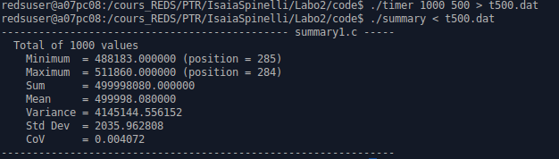
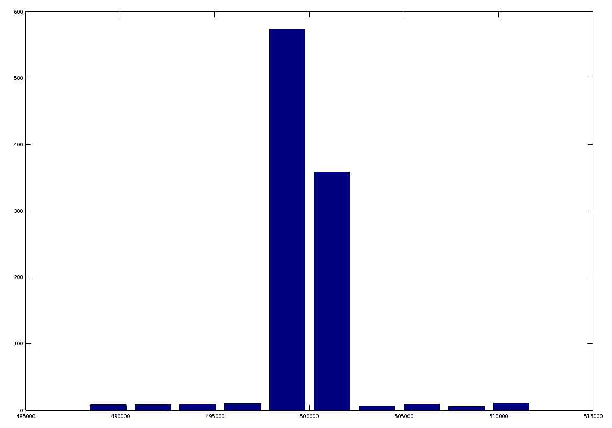

Résultat pour une intervalle de 1000 us :

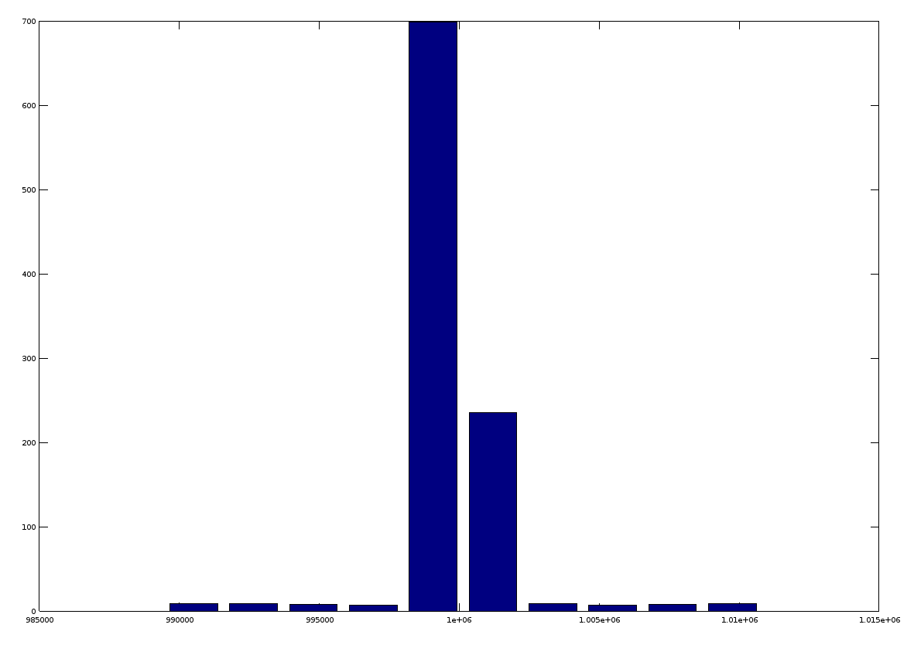

Résultat pour une intervalle de 250 us :

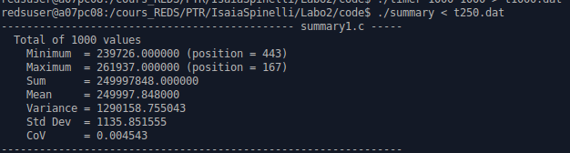	
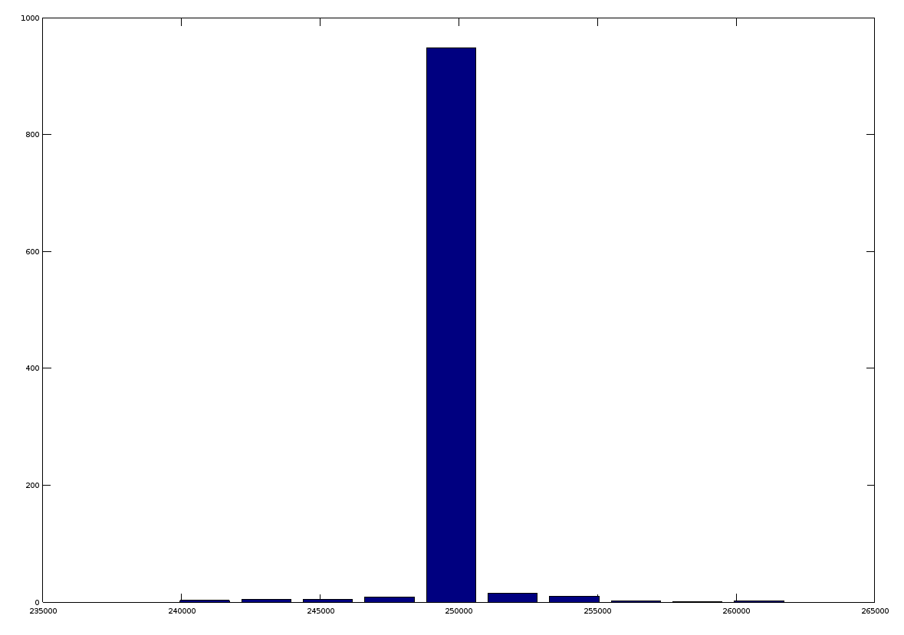

Remarque: 

On peut facilement voir avec les histogrammes que les résultats sont correctes. Il y a quelques valeurs à cotés mais ceci est négligeable.

Test pour 1000 mesures avec une intervalle de 1ms 2 fois de suite:

Remarque :

On peut constater que la moyenne est généralement assez précise. Par contre, la variance et le standard déviation n'est pas trop régulier. Il peut vite y avoir des pics (entre 200 - 1200 environ).

## Perturbations

Pour cette étape, j'ai surtout regardé le standard déviation afin de voir facilement les perturbations qui pourraient être causées.

### niceness

nice avec plusieurs coeurs :
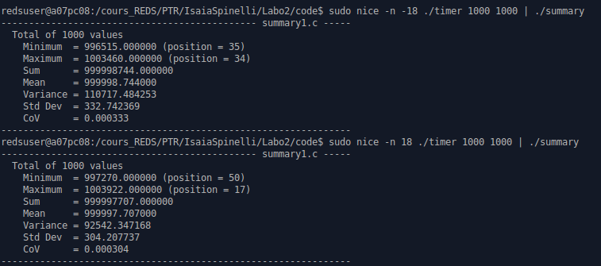
nice à un cœur :
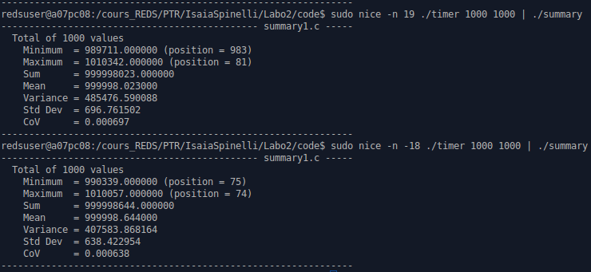

Nous pouvons voir les résultats une fois avec une niceness de -18 et une autre avec 18 ou 19. On peut remarquer qu'il n'y a pas de différence sur un cœur ou plusieurs.

nice + grep (1: avec grep - 2: sans grep) :
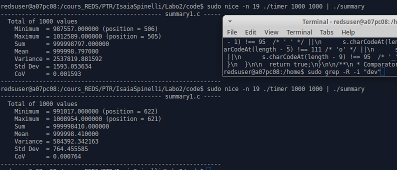

Par contre, en faisant une grosse opération, on peut voir la différence. La variance est plus élevé (1600) quand le grep tourne en même temps.

Afin de confirmer la perturbation avec grep, j'ai fait deux mesures en laissant grep tourner derrière. Ici on peut clairement voir que le standard déviation monte jusqu'à 4000.
(1 et 2: avec grep)
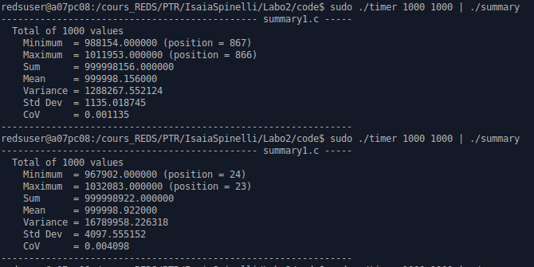

Je pense que le processus grep tourne sur tous les cœurs mais que parfois, il utilise le cœur utilisé par le timer. Donc, il arrive à perturbe un peu le timer.

### ./cpu_loop

Plusieurs cœurs :
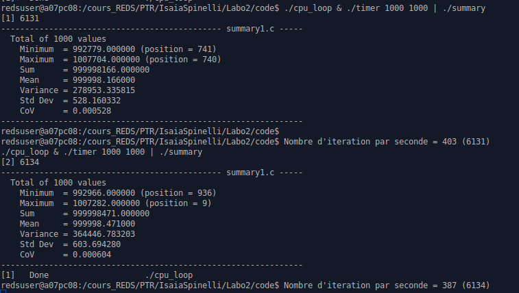

Bien sûr, on ne voit pas de différence car on a plusieurs cœurs. Par contre, voici ci-dessous deux mesures avec un cœur.

Un cœur :
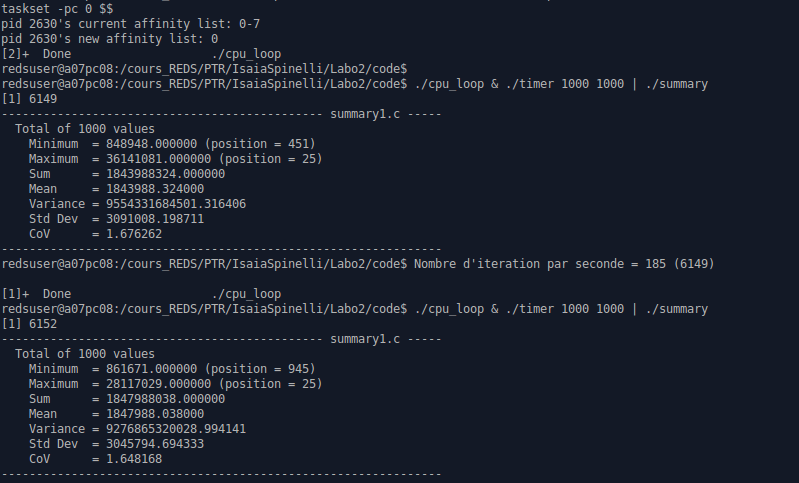

On peut voir que les résultats sont complétement à la masse. Ce qui est normal car le processus cpu_loop prend beaucoup de temps processeur. En effet, comme ils travaillent sur le même coeur, il arrive que le timer se fasse pré-empter à des moments critiques.

### Ping

Voici 2 mesures en recevant des pings:
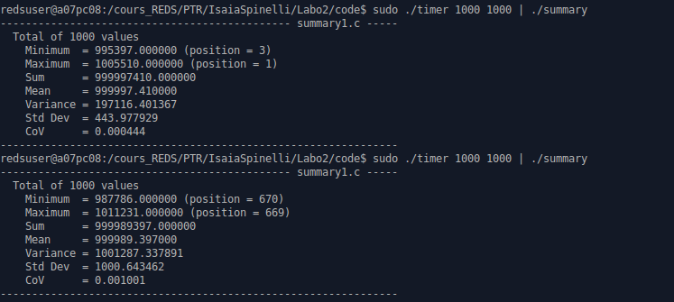
On peut voir que la variance est comme d'habitude, elle peut varier mais rien de très spécial.

## Conclusion

Afin de perturber notre timer, il faut prendre beaucoup de temps CPU sur le même cœur où le timer tourne. Sinon, on peut voir que le timer est en moyenne précis avec une moyenne qui s'écarte de 2 ou 3 ns du temps souhaité.
