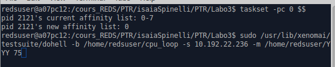
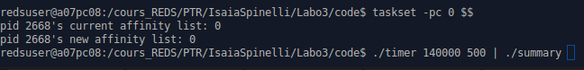
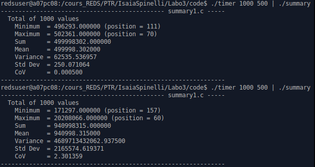
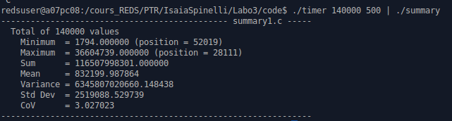
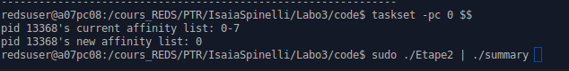
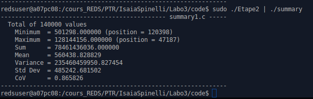
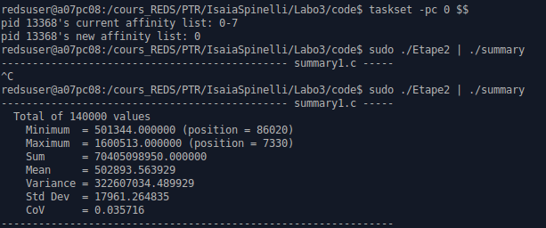
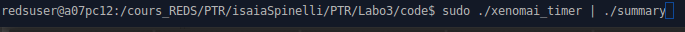
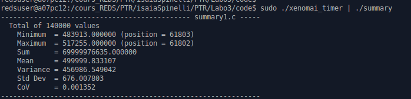

# PTR Laboratoire 3
## Linux et Xenomai

Spinelli Isaia

le 09 Novembre 2019

[TOC]

## Introduction et objectif

Lors du dernier labo nous avons testé les capacités d’une application à servir des tâches périodiques
sous différentes conditions. Nous allons maintenant effectuer des tests et récolter des données dans
un environnement plus chargé en termes d’utilisation du temps processeur. Afin de créer un tel
environnement, nous allons utiliser les commandes suivantes :

Les options du script dohell sont les suivantes :
1. -b hackbench : chemin de l’application ou du script à stresser
2. -s server [-p port] : destination à laquelle des paquets réseau seront envoyés via nc (ou netcat) ;
le port par défaut est 9
3. -m folder : répertoire (ou point de montage) dans lequel un fichier de 100MB sera créé et rempli
de 0 grâce à une boucle infinie
4. duration : temps d’exécution du script, en secondes

## Etape 1 Priorité des threads et Linux

Pour tous le laboratoire j'ai choisi une période de **500 us**. Donc, afin de l'exécuter longtemps (70 secondes) il faut faire 140'000 mesures.

Il est important de lancer le timer sur le même cœur que le programme "dohell" afin de le perturber au maximum. Voici la commande à exécuter :

Voici-ci dessous 2 résultats différents:
 - 1 : Timer sans perturbation
 - 2 : Timer avec perturbation

On peut clairement voir que sans perturbation le timer est correcte. Par contre, avec de la perturbation, la moyenne double donc il y a une erreur de 100%. De plus, la variance prend une valeur extrême. On ne peut clairement pas faire de temps réel avec ce genre de timer.

Afin d'avoir une mesure sur plus d'une minute avec perturbation, voici la commande et le résultat :

On peut voir que la moyenne est toujours complètement fausse et la variance toujours très élevée.

## Étape 2 Priorités

Maintenant que nous avons un environnement pour lancer les expériences, nous allons l’utiliser sur
différentes solutions. Dans cette étape, nous avons écrit un programme qui exécute une tâche périodique dans une tâche haute priorité et qui utilise la fonction nanosleep() pour attendre une période de temps à l’intérieur d’une boucle.

Remarque : La commande pour la perturbation est toujours la même décrite dans l'introduction.

Voici la commande à taper pour lancer les mesures :

Remarque : la commande sudo est importante afin de pouvoir changer la priorité du thread.

Pour commencer, voici les résultats sans perturbation :

On peut voir que la variance est énorme et que la moyenne n'est pas précise. Donc de base on peut constater que le nanosleep est moins précis qu'un timer ce qui semble correcte.

Ensuite, voici les résultats avec perturbations :

On peut voir que les résultats sont meilleurs. La moyenne est plus précise et la variance est moins extrême. Je ne serais pas expliquer pourquoi mais il reste évident que pour du temp réel cette solution semble toujours pas bonne.

## Étape 3 Xenomai

Maintenant le but est de faire la même chose mais via l'interface native de Xenomai. Etant donné que celui-ci prend en charge le temps réel, on espère que les résultats seront bien plus précise que précédemment.

Remarque : La commande pour la perturbation est toujours la même décrite dans l'introduction.

Voici la commande à taper pour lancer les mesures :

On peut voir ici les résultats avec perturbations :

La moyenne est extrêmement précise ! On voit que le temps réel est un autre monde que le non temps réel.
De plus, la variance reste relativement faible pour un temps de 500us.

Tous les codes sont en annexe et commentés.

Remarque: Malheureusement je n'ai pas mis d'histogramme car je trouve que ceux fourni par octave n'était pertinent dû au fait de la qualité du graphe.

## Conclusion
Le timer reste un peu mieux qu'un simple appelle à une fonction nanosleep() mais cela dit, le timer reste très loin des performances que l'interface de Xenomai propose. On constate que le temps réel fait une grosse différence de précision.
