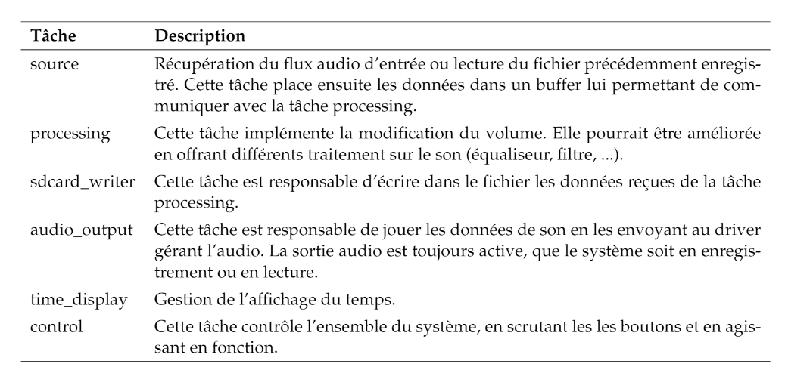

# PTR Laboratoire 6
## Isaïa Spinelli et Tommy Gerardi, le 07.01.2020

### Introduction et explications
Le but de ce laboratoire est de réaliser un lecteur / enregistreur audio capable de jouer des fichiers wav ainsi que de rejouer ce qui vient d’être enregistré, et ce sur une carte DE1-SoC.

La DE1-SoC possède une interface audio accessible depuis la partie logique programmable. Le système qui nous est fourni contient la partie logique ainsi qu’un driver spécialement développé pour ce laboratoire. Ce driver nous permet d’envoyer des données sur les deux canaux audios. En interne, il dispose d’un buffer de 128 mots par canal. De plus, il permet de piloter et scruter les différentes E/S de la carte (afficheurs 7seg, boutons poussoirs, leds et switchs). L’enregistrement se fera sur un fichier unique, et ce fichier sera relu pour le playback. Il n’est pas demandé de pouvoir travailler avec d’autres fichiers.

### Choix architecturaux
Afin de réaliser notre lecteur / enregistreur audio, nous avons décidé de le séparer en 6 tâches distinctes comme proposé dans la donnée :

audio_data_i, sd_out et audio_out sont 3 buffers (boîtes aux lettres) permettant l'échange des données audios.

Voici la description des différentes tâches :

### La synchronisation

Afin de synchroniser les 6 tâches, plusieurs méthodes ont été utilisées :

- Une sémaphore est utilisée afin de créer une barrière de synchronisation pour attendre que toutes les tâches soient prêtes.

- Une variable globale "volume" (0-10) modifiée seulement dans la tâche "control_task" lors d'un changement de position des switches. Cette variable globale n'est pas protégée contre les accès concurrents. Il aurait été possible de mettre un mutex en place afin d'y remédier, mais nous n'avons pas jugé cette mesure nécessaire dans ce cas car les tâches autres que control n'y accèdent qu'en lecture, et une mauvaise lecture n'impactera pas le fonctionnement du système.  

- Finalement, un drapeau événement (RT_EVENT) permet de communiquer le mode dans lequel nous sommes (playing, recording, paused) ainsi que des actions à traiter (forwarding, rewinding, new recording,...). Le fichier **snd_player.h** contient les constantes qui décrivent la fonction de chaque bit utilisé.

### Les périodes

Parmi ces 6 tâches, 3 d'entre elles s'exécutent de manière périodique :

- source_task : Période de 2ms, faute de quoi l'audio n'est pas lu assez vite ce qui mène à des problèmes à l'écoute.
- time_display_task: Période de 10 ms car c'est la plus petite résolution de l'affichage.
- control_task : Période de 150ms car cela nous semblait être une bonne valeur entre 2 appuis consécutifs sur des boutons, elle aurait pu être plus courte mais nous n'avons pas jugé nécessaire de changer ça.

Remarque : Pour plus d'informations sur les périodes, veuillez-vous référer aux commentaires du code.

Pour les 3 autres tâches (audio_output_task, sdcard_writer_task, processing_task), elles attendent constamment la réception de données audio via leur boîte aux lettres respective, elles vont donc se bloquer toutes seules et ne prendront pas de temps CPU inutilement. Elles se réveilleront lorsqu'on leur enverra des données.

### Les priorités

Nous avons défini trois priorités disctinctes pour nos tâches :

- **PRIO_TASKS_AUDIO** : Elle vaut 99, c'est la plus élevé des priorités et nous l'avons attribuée à toutes les tâches qui traitent les données audio. C'est la partie la plus importante d'après nous. Un délai trop élevé sur ces tâches pourrait mener à un fonctionnement défectueux.

- **PRIO_TASKS_CONTROL** : Elle vaut 50, nous l'avons attribuée à la tâche de contrôle. Nous pensons que la pression sur les bouttons est moins importante que la gestion des données audio.

- **PRIO_TASKS_DISPLAY** : Elle vaut 10, c'est la plus faible des priorités utilisées. Elle est attribuée à l'affichage, que nous considérons comme la moins importante des fonctionnalités du programme.

Quant aux priorités présentes pour la sémaphore et les boîtes aux lettres, nous avons toujours choisi qu'elles soient par priorité. Cela ne change rien à notre système dans le cas présent mais dans le cas où on voudrait rajouter des éléments, il nous semble plus judicieux de procéder par priorité.
### Utilisation

Voici un exemple d'utilisation du programme. Il est important de savoir que le programme démarre en lisant le fichier passé comme paramètre, ainsi il faut que ce soir un fichier wav valide qu'on puisse parser correctement. C'est dû au fait que nous avons repris le fonctionnement du laboratoire précédent. Nous avons décidé de laisser de l'affichage afin d'avoir une meilleure idée de ce qui se passe.  
Lorsqu'on arrive à la fin d'un fichier, on peut le relancer en appuyant sur play.  

  Nous n'avons rencontré aucun problème avec notre programme lors des divers tests que nous avons réalisés.

### Améliorations
Voici diverses améliorations qu'on pourrait apporter à notre système :

- Gestion du temps avec une seule variable, ce n'est pas le cas présentement et nous avons des magic numbers liés à ce problème
- On pourrait imaginer un moyen de quitter l'application autrement qu'avec un CTRL+C ou alors de gérer ce signal avec une fonction qui libère les resssources correctement
- On pourrait créer nous même le fichier wav dans le cas où le paramètre passé au programme n'en est pas un
- Nous avons actuellement une valeur un peu hasardeuse pour la taille des buffer pools pour les boîtes aux lettres, il faudrait en mettre des plus adaptées (pour que le système fonctionne toujours mais soit résistant à des ralentissements)

### Conclusion
Ce laboratoire nous a permis de mettre en pratique ce que nous avons vu en cours. L'avantage de ce laboratoire est qu'il est ludique et que les fichiers fournis permettent de rapidement se mettre dedans en comprenant ce qu'on doit faire et ce qui est déjà fait. C'était particulièrement sympa de pouvoir nous enregistrer et nous écouter, cela nous a permis de plaisanter en travaillant.

Gerardi Tommy et Spinelli Isaia le 26 janvier 2020.
